# Research Engineering Intern Assignment - Social Media Analysis Dashboard

[Hosted Prototype](YOUR_HOSTED_PROTOTYPE_URL_HERE) | [Video Prototype](YOUR_VIDEO_PROTOTYPE_URL_HERE)

A powerful, interactive dashboard for analyzing social media conversations, trends, and network dynamics. This tool allows researchers and analysts to explore patterns in social media data, identify key trends, and detect coordinated behavior.

## [System_Architecture_Diagram]

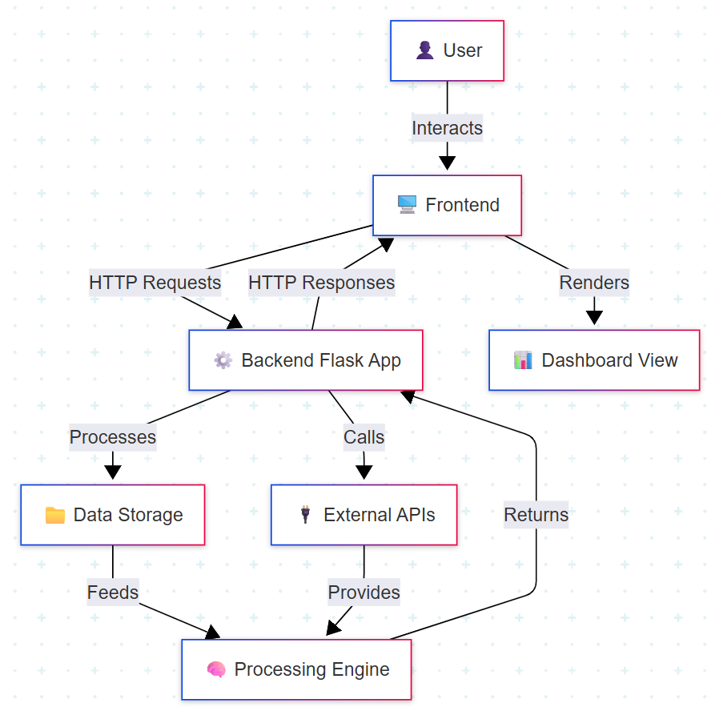

## Features

- **Social Media Insights: Trends, Sentiments and Discussions**: Analyzes patterns in social media conversations using natural language processing, tracks sentiment changes through text analysis, and identifies emerging discussion topics using topic modeling
- **Key Metrics**: Provides essential statistics including post volume, engagement rates, and user activity levels calculated from the dataset
- **Word Cloud**: Generates interactive word clouds using D3.js, visualizing term frequencies with dynamic sizing and color gradients
- **Top Contributors**: Identifies and analyzes the most active users based on post frequency, comment counts, and engagement metrics
- **A Comprehensive Data Story**: Generates an AI-powered narrative story using LLaMA model via Groq API, synthesizing key insights and patterns from the data
- **Time Series Analysis**: Tracks post volume and engagement metrics over time using interactive D3.js visualizations with customizable date ranges
- **Topic Evolution Graph**: Visualizes topic changes over time using LDA (Latent Dirichlet Allocation) with interactive D3.js charts showing topic prevalence trends
- **Community Distribution Pie Chart**: Displays the distribution of posts and users across different communities using interactive D3.js visualizations
- **Topic Analysis**: Implements LDA topic modeling with customizable number of topics, word weights, and representative document examples
- **Semantic Map**: Creates a 2D visualization using UMAP dimensionality reduction and SentenceTransformer embeddings, with interactive clustering and topic labeling
- **Coordinated Post Groups**: Detects potentially coordinated posting activity using content similarity analysis and temporal pattern recognition
- **AI-Powered Interactive Chatbot**: Integrates Google's Gemini 2.0 Flash model for natural language queries about the dataset, providing detailed insights and analysis

## Project Structure

```
.
├── data/
│   └── data.jsonl    # Input data file for analysis
├── images/           # System architecture and UI screenshots
├── static/
│   └── js/
│       └── dashboard.js # Frontend JavaScript for dashboard interactivity and visualizations
├── templates/
│   └── index.html    # HTML template for the main dashboard page
├── app.py            # Main Flask application entry point and backend logic
├── README.md         # Project documentation (this file)
├── requirements.txt  # Python dependencies
```

## Installation

### Prerequisites
- Python 3.8+
- pip package manager
- Node.js (for advanced frontend development)

### Setup

1. Clone this repository:
   ```
   git clone <repository-url>
   cd social-media-analysis-dashboard
   ```

2. Install required Python packages:
   ```
   pip install -r requirements.txt
   ```

3. Place your data file in the correct location:
   ```
   mkdir -p data
   # Place your data.jsonl file in the ./data directory
   ```

4. Set up environment variables for API integrations:
   ```
   # Create a .env file in the project root
   echo "GROQ_API_KEY=your_groq_api_key" > .env
   echo "GEMINI_API_KEY=your_gemini_api_key" >> .env
   ```
   - Get a Groq API key by signing up at [console.groq.com](https://console.groq.com/keys)
   - Get a Gemini API key by signing up at [aistudio.google.com](https://aistudio.google.com/)

## Usage

### Starting the Application

1. Run the Flask application:
   ```
   python app.py
   ```

2. Open your browser and navigate to:
   ```
   http://localhost:5000
   ```

### Using the Dashboard

1. Enter your query or let the chatbot refine your query.
2. Click on the Analyze button after adding filters.
3. View insights on Key Metrics, Word Cloud, Top Contributors and Data Story.
4. Time Series Trends, Community Distribution, Topic Trends and Contribution Posts.
5. Explore Network Graph relationships between users and topics.
6. Check AI-powered analysis, including themes, key points, sentiment, and patterns.
7. Analyze social media engagement through dynamic charts and reports.

## Link to the dataset 
<a href="https://drive.google.com/drive/folders/13cYfPIV65j5AAh9GjuZR94sAx-7EFjnp?usp=sharing">Dataset</a>

## Data Requirements

This application requires a JSONL file with Reddit data in the following format:

```json
{"data": {"id": "post_id", "author": "username", "created_utc": 1627484400, "title": "Post title", "selftext": "Post content", "subreddit": "subreddit_name", "num_comments": 42, "permalink": "/r/subreddit/comments/post_id/title/"}}
```

Each line should contain a separate JSON object with a "data" field that contains the post information.

### Key Fields:
- `id`: Unique identifier for the post
- `author`: Username of the post author
- `created_utc`: Unix timestamp of when the post was created
- `title`: Title of the post
- `selftext`: Main content of the post
- `subreddit`: The subreddit where the post was published
- `num_comments`: Number of comments on the post
- `permalink`: Relative URL path to the post on Reddit
- `parent_id`: For comments, the ID of the parent post/comment (prefixed with t3_ for posts)

## Screenshots of the Platform

### [Dashboard]

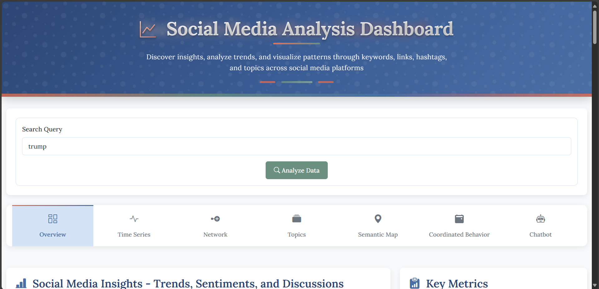

### [Social_Media_Insights_and_Key Metrics]

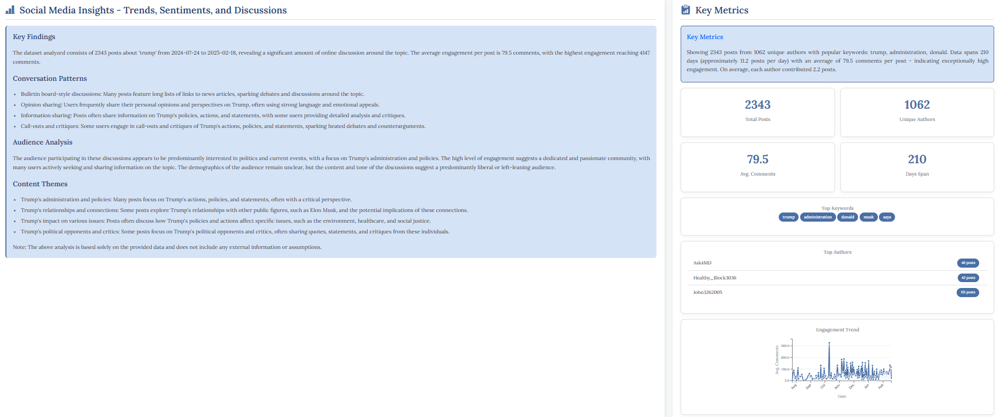

### [Word_Cloud_and_Top_Contributors]

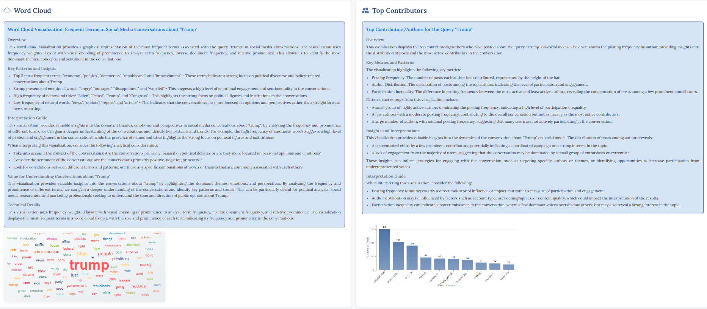

### [Comprehensive_Data_Story]

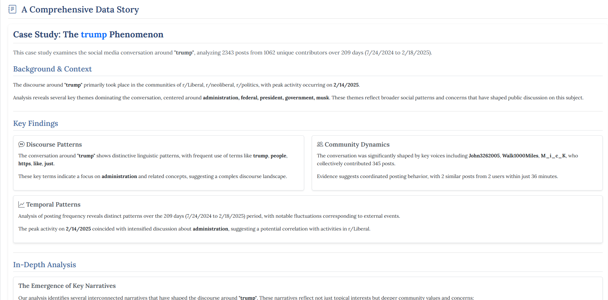

### [Time_Series_Graph]

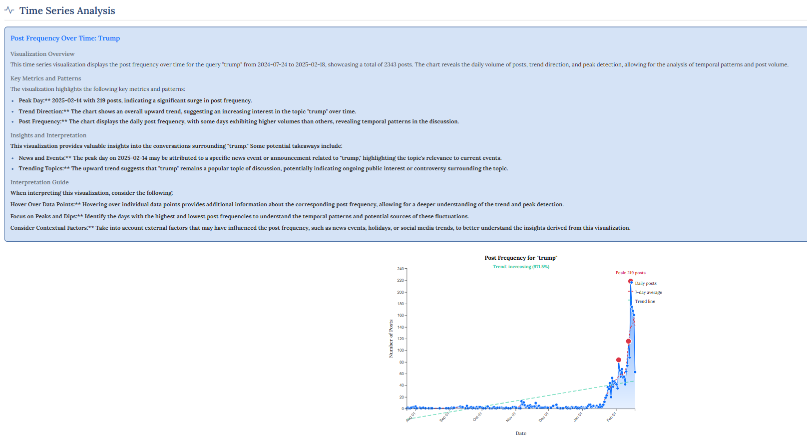

### [Topic_Evolution_Graph]

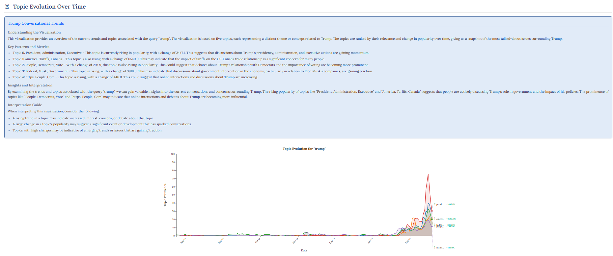

### [Community_Distribution_Pie_Chart]

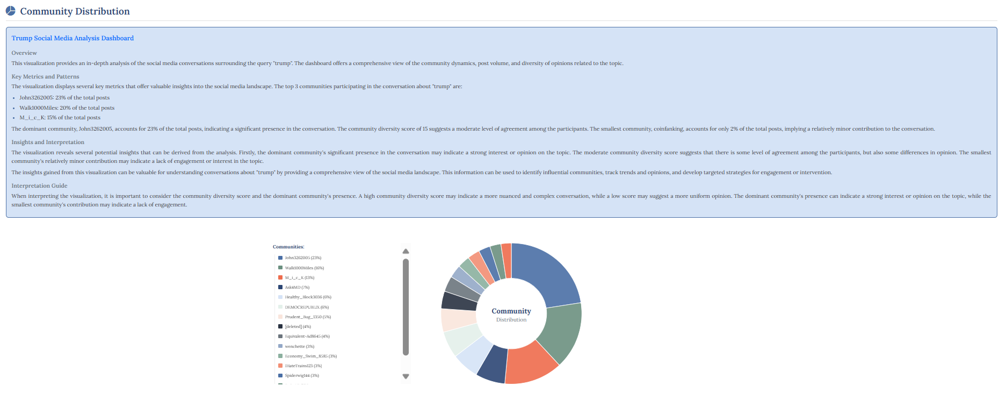

### [Topic_Analysis]

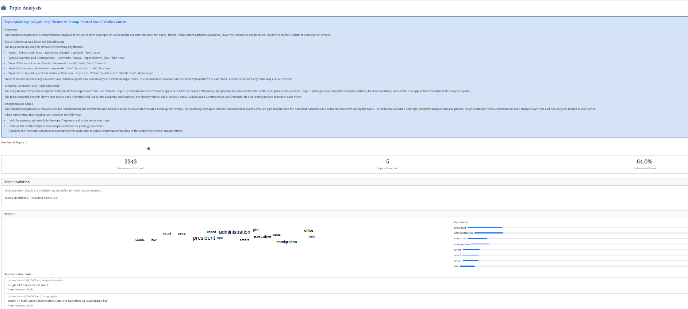

### [Semantic_Map]

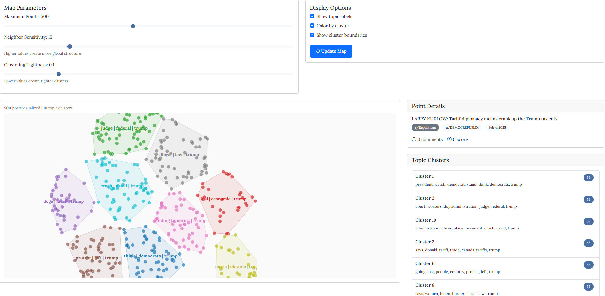

### [Contributors_Post_Groups]

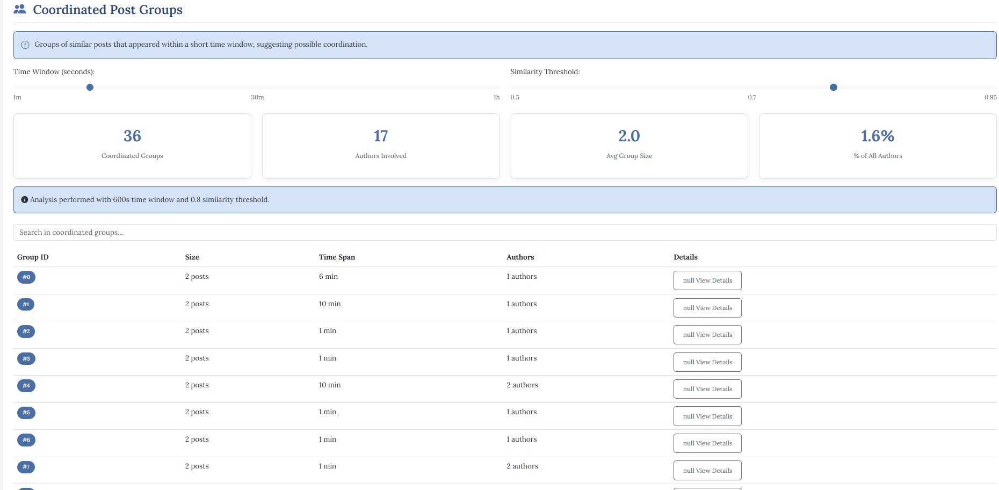

### [AI-powered_Interactive_Chatbot]

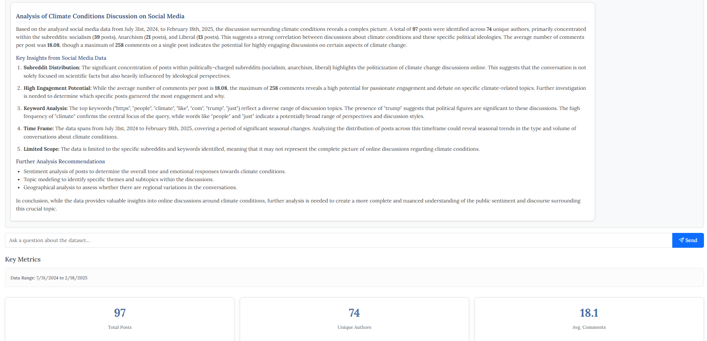


Made with love by Darshan Dihora ❤️


